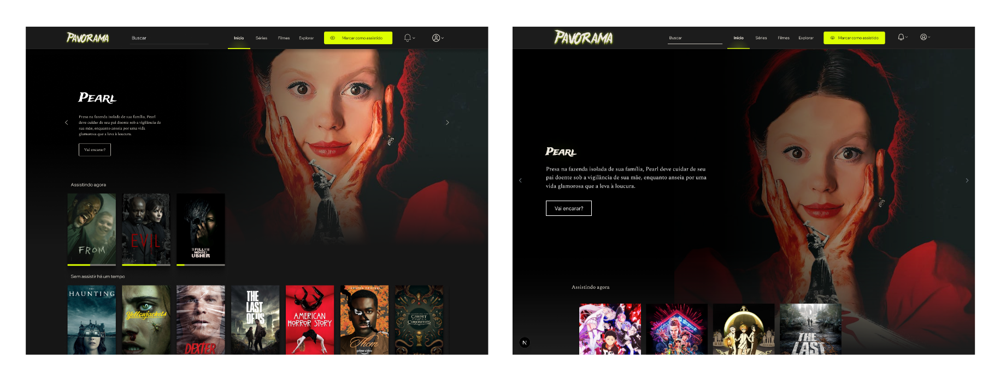
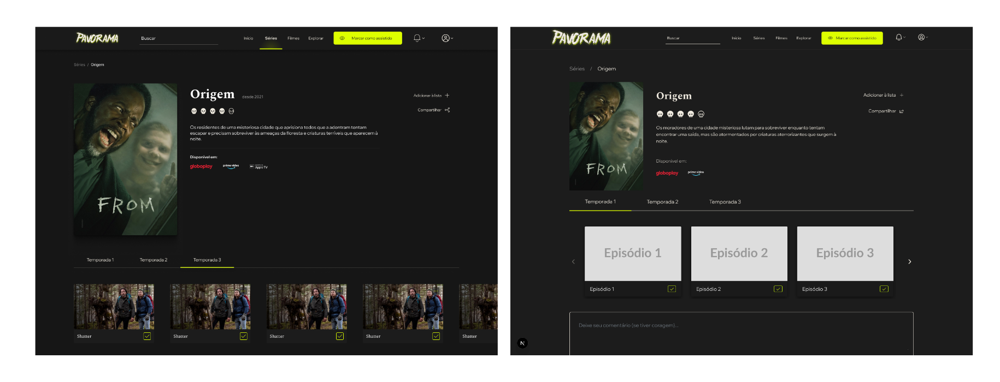
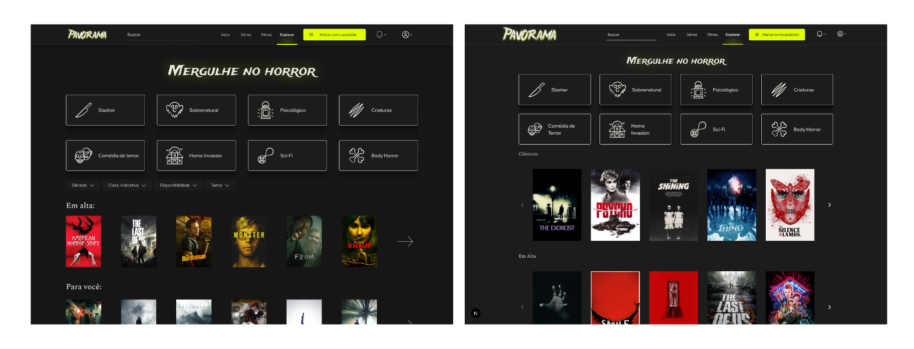
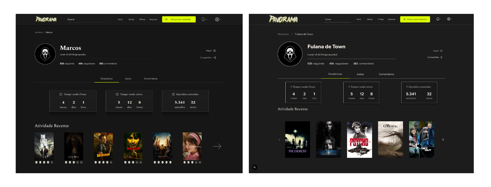

# Pavorama - Horror Tracker

> Sua jornada definitiva pelo universo do terror. Explore, organize e mergulhe no medo.


---

### Índice

- [Sobre o Projeto](#sobre-o-projeto)
- [Funcionalidades](#funcionalidades)
- [Tecnologias Utilizadas](#tecnologias-utilizadas)
- [Como Executar](#-como-executar-o-projeto)
- [Equipe](#-equipe)

---

### Sobre o Projeto

O **Pavorama** é uma interface web criada para entusiastas do gênero de terror. Inspirado em plataformas de acompanhamento como o "TVTime", nosso objetivo é oferecer um espaço centralizado para que fãs possam organizar, descobrir e explorar o vasto universo de filmes e séries de terror.

Este projeto nasceu no contexto da disciplina de **Interação Humano Computador (IHC)**, com o foco em desenvolver uma interface de usuário que seja intuitiva, imersiva e envolvente. Acreditamos que a experiência de interação com o conteúdo é tão crucial quanto o próprio conteúdo.

> **Nota:** O repositório no GitHub é nomeado `Umbra`, que foi o codinome inicial do projeto. O nome oficial da aplicação é **Pavorama**.

### Funcionalidades

Temos um roteiro claro de funcionalidades para tornar o Pavorama a ferramenta essencial para todo fã de terror:

-   🗺️ **Exploração Profunda:** Navegue por um catálogo completo de filmes e séries, com filtros avançados por subgênero, ano de lançamento, diretor e mais.
-   👤 **Perfis Personalizados:** Crie seu perfil para marcar filmes como assistidos, montar sua watchlist, acompanhar o progresso de séries e criar listas temáticas.
-   🔮 **Descoberta Inteligente:** Receba sugestões personalizadas de novos títulos com base no seu histórico de visualização e nas suas avaliações.
-   💬 **Comunidade e Avaliações:** Avalie e comente sobre os títulos que você assistiu, compartilhando suas opiniões com outros membros da comunidade.

### Tecnologias Utilizadas

O Pavorama é construído com tecnologias modernas que garantem uma experiência de usuário rápida, escalável e agradável:

-   **[Next.js](https://nextjs.org/):** Framework React de produção para construir uma aplicação web performática e otimizada para SEO.
-   **[React](https://reactjs.org/):** Biblioteca JavaScript para a criação de componentes de interface de usuário interativos e reutilizáveis.
-   **[Sass](https://sass-lang.com/):** Pré-processador CSS que nos permite escrever estilos de forma mais organizada, modular e poderosa.
-   **[Phosphor Icons](https://phosphoricons.com/):** Uma família de ícones flexível e elegante para uma interface nítida e intuitiva.

### 🚀 Como Executar o Projeto

Para configurar e rodar o Pavorama localmente, siga os passos abaixo:

1.  **Clone o repositório:**
    ```bash
    git clone https://github.com/omarcosss/Umbra.git
    ```

2.  **Navegue até o diretório do projeto:**
    ```bash
    cd Umbra
    ```

3.  **Instale as dependências:**
    ```bash
    # Usando npm
    npm install

    # Ou usando Yarn
    yarn install
    ```

4.  **Inicie o servidor de desenvolvimento:**
    ```bash
    # Usando npm
    npm run dev

    # Ou usando Yarn
    yarn dev
    ```

5.  Abra seu navegador e acesse [http://localhost:3000](http://localhost:3000) para ver o projeto em ação.

### 👥 Equipe

Este projeto está sendo desenvolvido por uma equipe dedicada de estudantes:

-   Alysson ([@alyssonwa](https://github.com/alyssonwa))
-   David ([@bunny-sammy](https://github.com/bunny-sammy))
-   Geovane ([@geovanecavalcante21](https://github.com/geovanecavalcante21))
-   Marcos ([@omarcosss](https://github.com/omarcosss))
-   Stefano ([@StefanoCappello](https://github.com/StefanoCappello))

### Comparações (Figma/Projeto)







